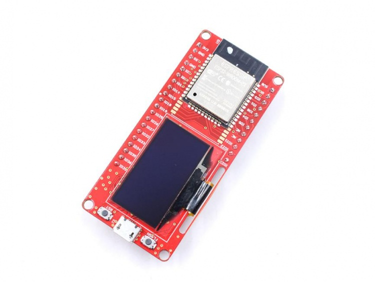
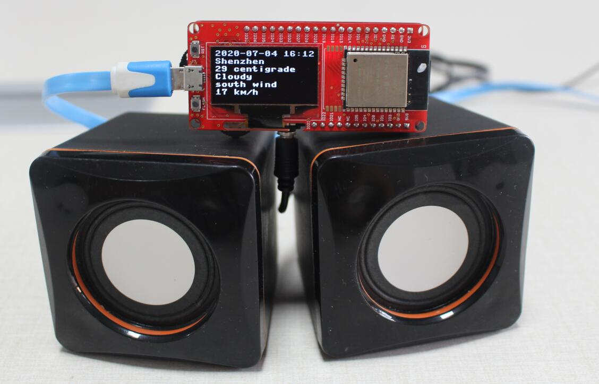

# Makepython-ESP32

```c++
/*
Version:		V2.1
Author:			UNKOWN
Create Date:	UNKOWN
Note:
	2023/2/13	V2.1: Add arduino example.
	2020/7/24	v2.0: Rebuid readme,add pic. By Vincent
*/
```

[toc]

# Introduce

Python is one of the most widely used, simple and easy-to-learn programming languages around. MicroPython is a lean implementation of the Python 3 programming language that has been pared down to run efficiently on microcontrollers.
MakePython ESP32 is preloaded with MicroPython, simple and suitable for beginners to learn the basic programming with MicroPython, Of course, users can free to change it to make it work with other platforms such as Arduino/GCC.



- You can get one from: [Makepython-ESP32](https://www.makerfabs.com/makepython-esp32.html)

- Hardware and detailed instructions please visit Wiki page:  [Makepython-ESP32 Wiki](https://wiki.makerfabs.com/MaESP_ESP32.html)

# Related Projects

## [Project_IoT Irrigation System](https://github.com/Makerfabs/Project_IoT-Irrigation-System)

- IoT agricultural irrigation experiment based on Lora communication.
- [YOUTUBE:Lora IoT Irrigation System - Outdoor Simulation Test](https://youtu.be/0mY6Ox0YvRk)


## [Project_MakePython_Audio_Music](https://github.com/Makerfabs/Project_MakePython_Audio_Music)

- Make a music player by yourself.
- [YOUTUBE:MakePython Audio Music Play](https://www.youtube.com/watch?v=0urJ_uxfW0k&feature=youtu.be)


## [Project_TTS-Weather-Broadcast](https://github.com/Makerfabs/Project_TTS-Weather-Broadcast)

- Internet weather voice broadcast by TTS(Text to Speech).
- [YOUTUBE:TTS-Weather-Broadcast](https://youtu.be/00nAEQKYFV4)


